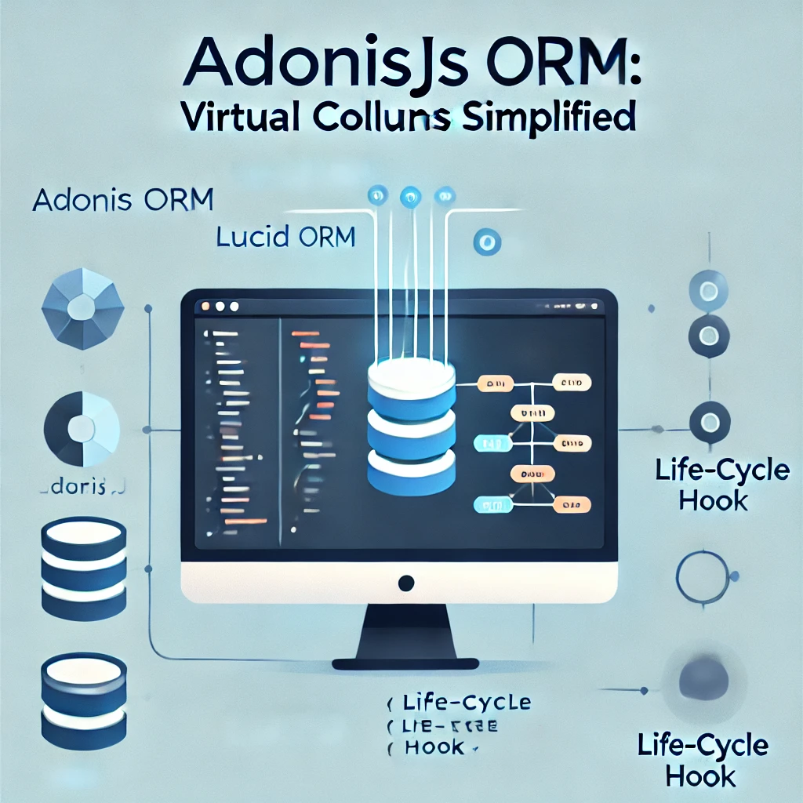

AdonisJS ORM: Harnessing Virtual Columns in Lucid ORM Models
===



In AdonisJS, leveraging computed columns in Lucid ORM models can be a powerful feature. One such example is the `myComputed` computed column. However, when a sibling relationship (e.g., `HasMany`) is used within the `myComputed` function, the computed result may become inaccurate or inconsistent. This article explores a refined approach to computed columns to reduce asynchronous data-loading dependencies.

## Problem Overview
Consider the following example Lucid ORM Model where the computed column `myComputed` references the childs relationship defined using HasMany:
```
@hasMany(() => Child)
childs!: HasMany<typeof Child>
@computed()
get myComputed(): string | null {
  return this.childs;
}
```
Using a `HasMany` relationship directly within the `myComputed` function creates issues because the relationship is asynchronous and depends on runtime data loading. This approach can lead to incorrect or incomplete results for the computed column.

## Refactoring Approach
To address these challenges, we can:

1. Remove data retrieval for the computed column from sibling relationships (`HasMany`).
2. Utilize SQL queries directly within the myComputed function for precise control.
3. Employ lifecycle hooks (`@afterFind`, `@afterSave`, `@afterCreate`, `@afterUpdate`) to compute and assign the value of the output column.
4. Introduce an internal column to store the computed value temporarily, ensuring consistent access across the model.

## Implementation Steps
### Step 1: Define an Internal Temporary Column
Create an internal column to hold the computed value. This avoids direct reliance on asynchronous operations during runtime.
```
// Temporary internal column
private internalTemp: string | null = null;
// Output virtual column
@computed()
get virtualColumn(): string | null {
  return this.internalTemp;
}
```
### Step 2: Compute the Virtual Column in Lifecycle Hooks
Use AdonisJS lifecycle hooks to invoke the computation logic for the virtual column at appropriate stages.
```
@afterFind()
@afterSave()
@afterCreate()
@afterUpdate()
static async myComputed(model: Model) {
  // Write SQL query to compute the value
  const result = await Database.rawQuery('SELECT ...');
  // Assign the computed result to the internal temporary column
  model.internalTemp = result;
}
```
## Reference
https://lucid.adonisjs.com/docs/serializing-models#computed-properties
https://lucid.adonisjs.com/docs/model-hooks#available-hooks
