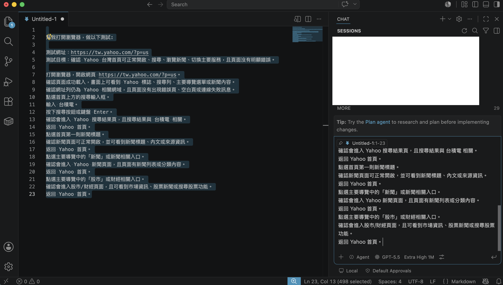
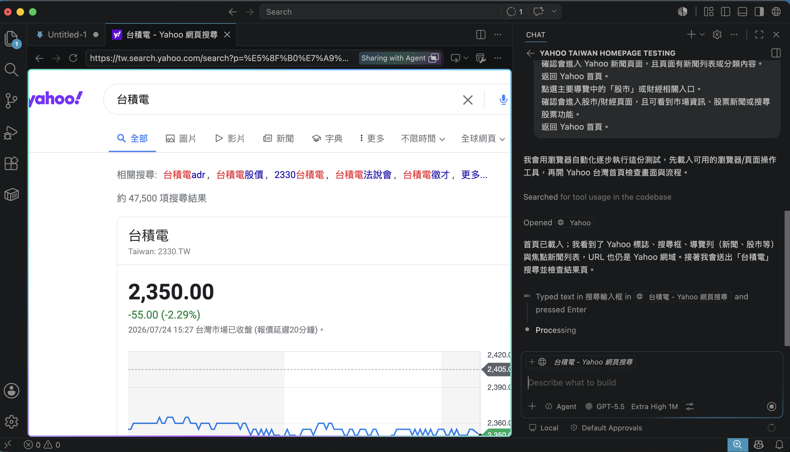

# VS Code + AI Chat：執行簡易 E2E 瀏覽器自動化測試

在傳統的前端開發與 QA 測試流程中，若要針對網站進行端到端（E2E, End-to-End）測試，通常需要撰寫繁複的 Playwright、Puppeteer 或 Cypress 測試腳本，定義 CSS/XPath Selector，並配置測試執行環境。這對於快速驗收或開發者自測（Dev Testing）而言，門檻與維護成本往往過高。

現在，結合 **VS Code** 與 **AI Chat（具備瀏覽器自動化 Tool / Agentic Tools）**，開發者與 QA 無需撰寫任何一行測試程式碼，只要在 VS Code 的對話視窗中使用自然語言描述測試目標，AI 就能直接啟動瀏覽器、自動完成點擊、搜尋、跳轉驗證，並精準回報頁面異常與主控台（Console）錯誤。

本文將以 **Yahoo 台灣首頁功能巡檢** 為例，示範如何在 VS Code 內透過 AI Chat 完成一套完整的簡易自動化 E2E 測試。

---

## 1. 測試目標與情境規劃

本次測試旨在驗證 Portal 網站的核心導覽功能與搜尋流程是否正常運作。

- **測試網址**：`https://tw.yahoo.com/?p=us`
- **測試目標**：確認 Yahoo 台灣首頁可正常開啟、搜尋關鍵字、瀏覽焦點新聞、切換主要頻道（新聞、股市），並檢查頁面是否有明顯的載入錯誤或死連結。
- **測試步驟規劃**：
  1. **首頁載入**：開啟 `https://tw.yahoo.com/?p=us`，確認標誌、搜尋列與導覽元件。
  2. **關鍵字搜尋**：搜尋「台積電」，驗證是否成功進入搜尋結果頁並顯示相關資訊。
  3. **新聞閱讀驗證**：返回首頁，點選第一則焦點新聞，確認文章標題、內文與作者資訊可正常讀取。
  4. **新聞頻道切換**：返回首頁，點選「新聞」導覽入口，確認進入 `tw.news.yahoo.com`。
  5. **股市頻道切換**：返回首頁，點選「股市」導覽入口，確認進入 `tw.stock.yahoo.com`。
  6. **測試收尾**：再次返回首頁，結束測試流程。

---

## 2. 在 VS Code 內由 AI Chat 自動執行測試流程

在 VS Code 側邊欄的 AI Chat 視窗中，只需將上述測試需求發送給 AI Agent，AI 便會掛載瀏覽器自動化工具並逐步進行操作與狀態檢查：

### 步驟一：開啟瀏覽器並載入首頁
AI 啟動內建瀏覽器載入 `https://tw.yahoo.com/?p=us`。
- **檢查結果**：首頁成功載入，畫面順利顯示 Yahoo 標誌、搜尋欄、主要導覽列（新聞、股市等）與焦點新聞清單，網址保持在安全的 Yahoo 官方網域。

### 步驟二：搜尋關鍵字「台積電」
AI 自動定位搜尋輸入框，輸入「台積電」並觸發 Enter 送出。
- **檢查結果**：順利跳轉至 `tw.search.yahoo.com` 搜尋結果頁。頁面精準呈現台積電即時股價資訊、股票代碼 `2330.TW`、`TSMC` 關鍵字以及多則相關財經新聞。

### 步驟三：驗證焦點新聞點擊與閱讀
AI 點擊首頁頂部連結返回首頁，並自動點擊第一則焦點新聞（*「直播／泰山、福壽、福懋油重訊 董座親上火線」*）。
- **檢查結果**：成功進入新聞內頁。文章標題、發布時間、作者來源與內文段落皆完整且清楚可讀。

### 步驟四：切換至「新聞」主要頻道
AI 返回首頁後，點擊主要導覽欄中的「新聞」頻道入口。
- **檢查結果**：網址成功切換至 `tw.news.yahoo.com`。頁面正常顯示 Yahoo 新聞 Header、各類新聞分類標籤（焦點、即時、國際、政治等）與動態新聞列表。

### 步驟五：切換至「股市」主要頻道
AI 返回首頁，接著點擊導覽欄中的「股市」頻道入口。
- **檢查結果**：網址順利跳轉至 `tw.stock.yahoo.com`。頁面正確顯示大盤行情數據、股票搜尋欄、今日要聞、上市熱門排行與個股動態。

### 步驟六：返回首頁完成測試
AI 完成所有頻道探測後，點擊 Logo 返回 `https://tw.yahoo.com/?p=us` 首頁，將環境還原至初始結束狀態。

---

## 3. 測試報告與問題發現（Test Results & Defect Summary）

AI 在執行自動化操作的同時，會同步監聽瀏覽器的頁面渲染狀態、網路請求（Network Requests）與 Console Event Logs。本次測試產出的自動化報告如下：

### 核心功能評估（Pass）
- **主要導覽與流程**：首頁、搜尋、新聞頻道、股市頻道與文章內頁均可順利切換與開啟，無出現死連結、空白頁（Blank Page）或伺服器連線失敗訊息。
- **資料正確性**：搜尋結果與新聞內容皆能精準匹配關鍵字與分類。

### 自動捕捉的異常缺陷（Discovered Issues）
雖然主要業務流程全數通過，但 AI Chat 成功捕捉到以下視覺與背景層面的潛在缺陷：

1. **模組級視覺錯誤（Medium）**：
   - 首頁與新聞內頁中的 **Yahoo TV 模組** 出現可見的媒體載入失敗提示：
     > `The media could not be loaded, either because the server or network failed or because the format is not supported. Error Code: 400-4`
2. **頁面渲染與背景網路異常（Low / Technical Debt）**：
   - **Hydration Error**：新聞內頁觸發了少量 React hydration 類型的頁面錯誤。
   - **第三方資源失敗**： Console Log 中記錄了多筆第三方廣告與追蹤腳本的網路錯誤（包含 `CORS` 阻擋、`ERR_ABORTED`、`ERR_NAME_NOT_RESOLVED` 與 HTTP `503` 狀態碼）。

---

## 4. VS Code + AI Chat 執行簡易 E2E 測試的核心優勢

透過本次測試範例，可以總結出在 VS Code 內結合 AI Chat 做瀏覽器自動化測試的四大優勢：

1. **零程式碼與維護成本（No-Code Test Execution）**：
   無需編寫 Playwright/Selenium 程式碼，也不用擔心 DOM 結構改變導致 Selector 失效。只需用語意化的自然語言說明測試目標，AI 便能彈性應對頁面變化。
2. **無縫整合開發環境（In-IDE Testing Workflow）**：
   開發者在 VS Code 修改前端代碼或 API 後，可以直接在編輯器旁邊的 AI Chat 視窗下達「*幫我測一下登入流程與購物車*」，無需開啟外部測試工具。
3. **即時深度日誌與網路監控（Deep Inspection）**：
   AI 不僅能「看」畫面，還能同步抓取瀏覽器的 Network 與 Console 訊息，自動發現視覺上不容易察覺的背後 API 異常或資源載入錯誤。
4. **自動生成結構化測試報告（Automated Reporting）**：
   測試結束後，AI 能直接將測試步驟、執行結果與 Bug 列表中整理成標準 Markdown 報告，方便直接貼至 GitHub Issue 或 JIRA 追蹤。

---

## 5. 總結

VS Code 結合 AI Chat 的瀏覽器自動化能力，為軟體開發與品質保證帶來了全新的工作模式。它填補了「手動人工點擊測試」與「龐大 E2E 測試框架」之間的空白，讓開發人員與 QA 能夠以極低的成本進行高效網站功能巡檢與測試！
