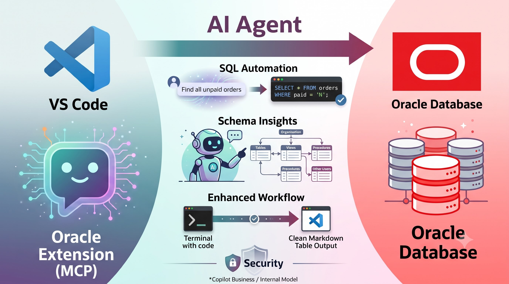
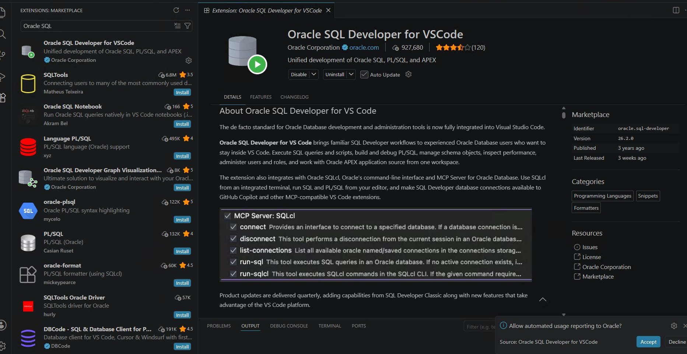

# VS Code + AI Chat：打造下一代 Oracle 資料庫開發操作工作流



在傳統的資料庫開發與維運流程中，查詢 Oracle 資料庫往往需要安裝獨立且龐大的專用軟體（如 Oracle SQL Developer 獨立版或 PL/SQL Developer），並且需要手動編寫繁複的 SQL 語法、處理 table join 關係以及除錯編碼問題。

隨著 VS Code 推出官方的 **Oracle SQL Developer for VSCode** 擴充套件（**該 Extension 本身即為一個原生 MCP Server**），並結合 AI Agent / AI Chat 功能，現在開發者可以直接在 VS Code 內透過自然語言讓 AI 自動執行 SQL 指令、讀取並分析資料庫內容。

本文將介紹如何設定與體驗這套高效率的 AI 輔助 Oracle 資料庫工作流。

---

## 1. 在 VS Code 下載原廠 Oracle Extension

首先在 VS Code 的 Extensions Marketplace（擴充功能市場）中搜尋並安裝由 **Oracle Corporation** 官方發行的 **`Oracle SQL Developer for VSCode`**。



### 核心亮點：Extension 本身就是一個 MCP Server
該原廠擴充套件不僅提供了在 VS Code 內開發 Oracle SQL、PL/SQL 和 APEX 的完整功能，**這個 Extension 本身更是一個標準的 MCP (Model Context Protocol) Server**，原生整合了 **Oracle SQLcl** 命令列工具並封裝多項 MCP Tools：
- **`connect`**：提供連線至指定 Oracle 資料庫的介面。
- **`disconnect`**：斷開目前的資料庫連線。
- **`list-connections`**：列出所有已儲存的 Oracle 資料庫連線。
- **`run-sql`**：在 Oracle 資料庫中執行 SQL 查詢。
- **`run-sqlcl`**：在 SQLcl CLI 中執行 SQLcl 命令。

這意味著只要支援 MCP Protocol 的 AI 助理（如 Cursor、Windsurf、GitHub Copilot 或 Claude / OpenAI 的 Agent），都能直接透過這個 MCP Server 讀取並操作 Oracle 資料庫，自動代表開發者下達查詢指令。

---

## 2. 設定 Oracle 資料庫帳號密碼登入

安裝完成後，VS Code 左側側邊欄會出現 **`SQL DEVELOPER`** 圖示。點擊後即可進行資料庫連線設定。

### 設定步驟：
1. 點擊 **`Create Connection`** 按鈕新增連線。
2. 設定 **Connection Name**（範例：`DEMO_DB dev_user`）。
3. 選擇 **Connection Type**（例如選用 **TNS** 模式，並指定 `tnsnames.ora` 的檔案路徑，如 `XXX:\TNS\tnsnames.ora`）。
4. 選擇對應的 **Network Alias**。
5. 輸入資料庫連線的 **Username** 與 **Password**。
6. 點擊 **Test** 測試連線成功後，點擊 **Save** 儲存並連線。

連線成功後，可以在左側 `CONNECTIONS` 樹狀目錄中展開資料庫結構，瀏覽包含 **Tables**、**Views**、**Indexes**、**Procedures**、**Functions**、**Sequences**，以及 **Other Users** 下的其他 Schema 物件。

---

## 3. 使用 AI Chat 功能，讓 AI 操作 Terminal 中的 SQL 指令與讀取資料

過去查詢資料需要自己開啟 SQL 編輯器寫 `SELECT ... LEFT JOIN ... WHERE ...`。現在有了 AI Chat 與原廠 Extension 的整合，只需在 Chat 視窗用自然語言下達指令（例如：「*列出未歸還的財產紀錄*」或「*查詢 SYS_USER 資料*」）。

### AI Agent 的自動化處理解析：
1. **自動下達 SQL 語法**：AI 會透過 Extension 內建的 SQLcl 工具（在 Terminal 中執行 `sql.exe /nolog`）自動執行跨表關聯查詢（例如關聯借用紀錄表 `BORROW_RECORD` 與資產主檔表 `ASSET_MASTER` 的 `LEFT JOIN`）。
2. **自我修正與編碼處理**：若 Terminal 輸出繁體中文遭遇 Console 編碼亂碼問題時，AI Agent 會主動下達：
   ```sql
   SET ENCODING UTF-8
   SET SQLFORMAT csv
   SET FEEDBACK OFF
   SPOOL C:\Users\demo_user\demo.csv
   ```
   將結果導出為 UTF-8 編碼的 CSV 檔案後再次讀取，精準克服主控台亂碼障礙。
3. **格式化輸出與業務分析**：AI 讀取結果後，會自動整理成美觀的 Markdown 表格顯示在 Chat 介面中，並主動附上統計說明（如：列出借用人編號、部門、財產編號、財產名稱與借出日期），甚至能補充排除/包含其他狀態（如 `PICKING` 領取中與 `CANCELLED` 已取消）的洞察。

---

## 4. 效益：大幅提升資料庫開發與運營效率

結合 VS Code 原廠 Oracle 擴充套件與 AI Chat，為開發與營運團隊帶來以下關鍵效益：

1. **節省大量寫 SQL 與多表 JOIN 的時間**：
   使用者只需用自然語言表達需求，AI 能自動搜尋對應的 Schema Table 名稱與欄位，自動撰寫正確的 `JOIN` 條件與日期格式化語法（如 `TO_CHAR(BORROWDATETIME, 'YYYY-MM-DD')`）。
2. **快速排查與除錯 SQL 語法**：
   當遇到 SQL 語法錯誤、型態不符或環境編碼問題時，AI 能直接捕獲錯誤訊息並自動嘗試修正（Self-healing），無需手動 Google 或翻閱官方文件。
3. **降低業務資料查詢門檻**：
   非 SQL 專家（如 PM、QA 或初級開發者）也能透過對話方式直觀取得資料庫內的業務數據，無需依賴 DBA 或資深工程師協助撰寫複雜 Script。
4. **單一開發環境整合**：
   無需在 VS Code 與獨立 SQL 工具之間頻繁切換，開發、寫 code、驗證 DB 資料與除錯完全在同一個編輯器視窗內完成。

---

## 5. 資安建議：MCP Extension 最好搭配 Copilot Business / 內網模型互動

由於這類 MCP Extension 能直接存取資料庫的 Schema 結構與實際資料，**建議最好讓 MCP Server 搭配 Copilot Business 或者企業內網自建的 Model Endpoint 互動**，讓 Prompt、資料庫 Schema 與查詢結果整條資料鏈都留在企業邊界內，對機敏資料庫提供最高等級的隱私保障。

---

## 小結

Oracle 官方發行的 `Oracle SQL Developer for VSCode` 擴充套件**本身就是一個強大的 MCP Server**，讓 AI Agent 能夠直接與 Oracle 資料庫無縫對話，在同一個編輯器內完成開發、查詢與除錯，大幅提升資料庫開發與營運效率！

