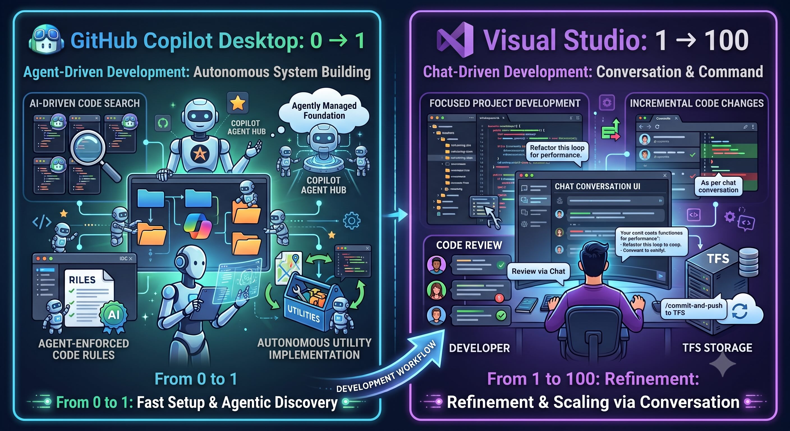
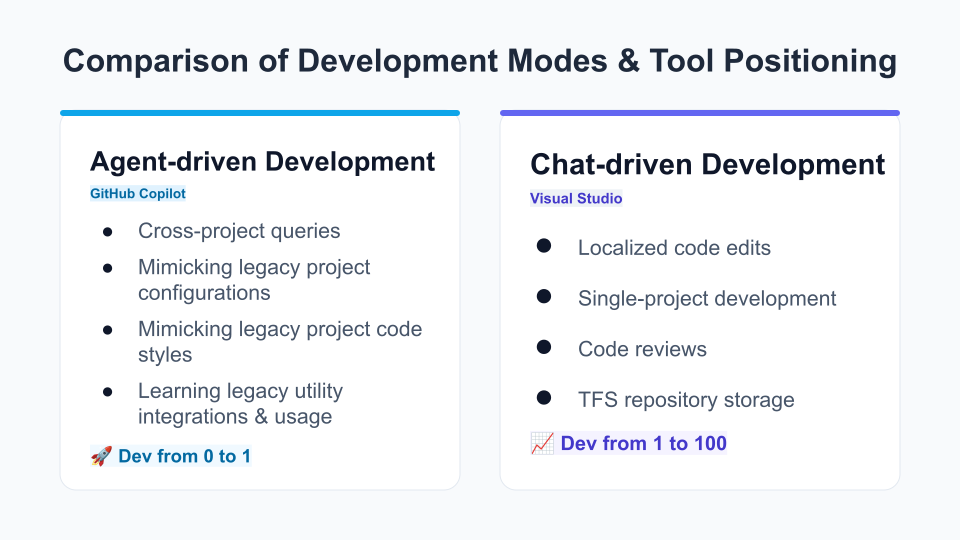

# 在網路管制的內網機上做 AI 協作開發：我的雙軌工作流心得

在公司的內網機上開發系統，最大的限制就是「網路管制」——很多外部資源和雲端服務都碰不到。但這不代表 AI 輔助開發就派不上用場，內網機上可以使用微軟的相關服務。摸索一段時間後，我整理出一套「雙軌」工作流：GitHub Copilot Desktop (agent-driven development) 負責從 0 到 1，Visual Studio (chat-driven development) 負責從 1 到 100，分工清楚，各司其職。

## GitHub Copilot Desktop (agent-driven development)：從 0 到 1 的專案啟動

這一軌的任務，是讓新專案快速站穩腳步，而不是每次都從零摸索。具體流程分三步：

1. 產生 PRD 文件
先透過 GitHub Copilot Desktop 協作，產出一份 PRD md file，內容涵蓋 Table Schema 與 API Spec，把資料庫結構和介面規格先講清楚，作為後續開發的依據。

2. 開新 Session，讀進跨專案脈絡
接著開一個新的 session，把剛產出的 PRD md file、目前的專案 A，連同過去做過的專案一起餵進去。這一步的用意在於：

跨專案查詢，掌握團隊過去的技術決策
新專案模仿舊專案的設定
新專案模仿舊專案的 code style
新專案學習舊專案導入過哪些 Utilities，以及這些 Utilities 該怎麼用

3. 產生程式
有了 PRD 和過去專案的脈絡當基礎，才正式請 AI 產生程式碼。這樣寫出來的東西，風格和架構才能跟團隊既有的專案接得起來，而不是各專案長得完全不像。

## Visual Studio (chat-driven development)：從 1 到 100 的深化開發

專案骨架立起來之後，後續的精修交給 Visual Studio (chat-driven development) 這一軌，特色是聚焦在單一專案內，做更細緻、更可控的事：

局部程式更改：針對單一專案做細部調整，不是大範圍重構
單一專案開發：專注在一個專案的脈絡裡，不跨專案發散
程式審核：仔細審查程式碼，確保品質與規範
TFS 儲存：審核通過後正式推送到 TFS，完成版本控管

如果說 GitHub Copilot Desktop (agent-driven development) 那一軌是打地基、蓋骨架，Visual Studio (chat-driven development) 這一軌就是把房子精雕細琢到能交屋的狀態。

## 貪心的選擇：全程掛著 Claude Fable 5 Max

老實說，這套流程我用得有點貪心——不管是 GitHub Copilot Desktop 那一軌的跨專案學習，還是 Visual Studio 這一軌的逐行審核，全程都掛著 Claude Fable 5 Max。理由很簡單：點數 token 還夠，如果 token 不夠，可以試試看 GPT-5.5 或者 Claude Opus 4.6 模型，他們反應比較慢，但也可以達到一定的協作效果。

## 小結

這套工作流的關鍵，是把「發散」和「收斂」分開處理：GitHub Copilot Desktop (agent-driven development) 負責發散——跨專案學習、模仿風格、搭新專案的骨架；Visual Studio (chat-driven development) 負責收斂——聚焦單一專案、仔細審核、正式進版。在網路管制的內網環境下，這樣的分工讓 AI 協作開發不只是「能用」，還能用得穩、用得有章法。