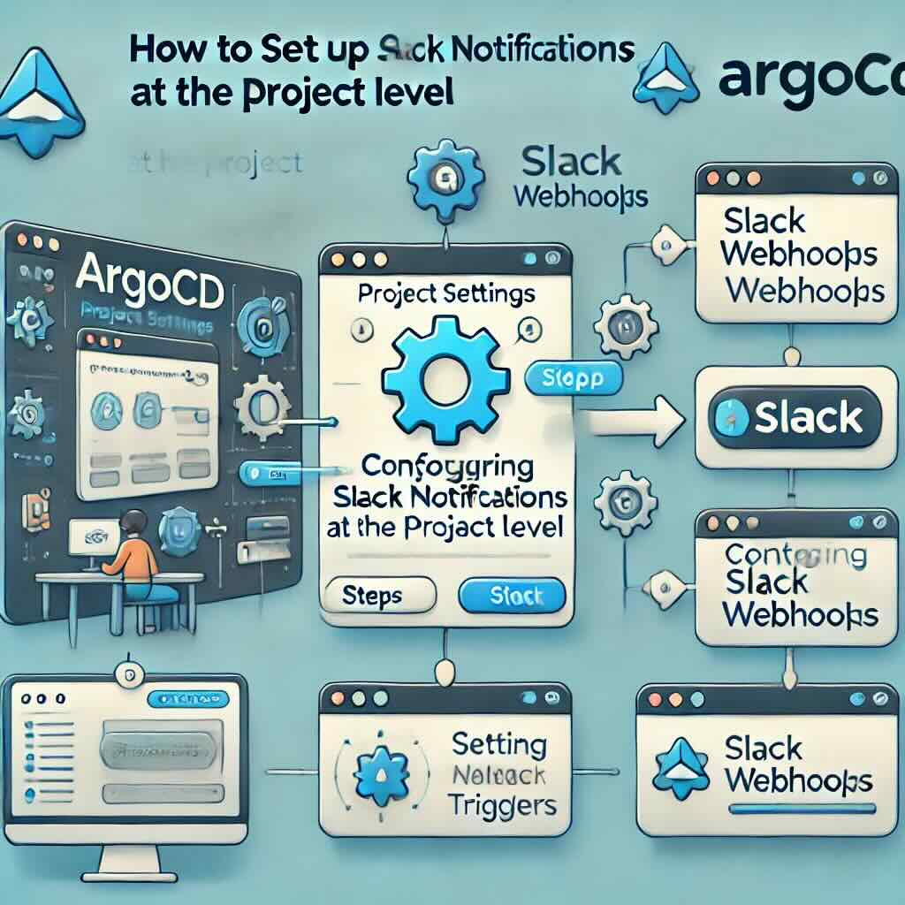

如何在 ArgoCD 在 Project Level 設定 Slack Notification?
===




## 問題
在 ArgoCD 中，可以針對每一個 App 設定 Notification，但如果 App 數量太多，想要批次設定 notification，該怎麼做呢？

## 設定流程
1. 在 Kubernetes 中，存放 ArgoCD 的 namespace 安裝 notification template
```
KUBECONFIG=~/.kube/argocd kubectl apply --namespace=your-namespace -f https://raw.githubusercontent.com/argoproj/argo-cd/stable/notifications_catalog/install.yaml
```

2. 把 Slack 的 token 放入 secret 中
```
KUBECONFIG=~/.kube/argocd kubectl --namespace=your-namespace edit secret argocd-notifications-secret
```
```
...
  apiVersion: v1
  kind: Secret
  metadata:
      name: argocd-notifications-secret
  data:
      slack-token: <Oauth-access-token>
```

3. 在 ConfigMap 設定訊息推送的觸發條件與接收 channel
```
KUBECONFIG=~/.kube/argocd kubectl --namespace=your-namespace edit configmap argocd-notifications-cm 
```
```
apiVersion: v1
kind: ConfigMap
data:
  service.slack: |
    token: $slack-token
  subscriptions: |
    - recipients:
      - slack:slack-prd
      selector: env=prd
      triggers:
      - on-sync-failed
      - on-sync-running
    - recipients:
      - slack:slack-pre
      selector: env=pre
      triggers:
      - on-sync-failed
      - on-sync-running
    - recipients:
      - slack:slack-stg
      selector: env=stg
      triggers:
      - on-sync-failed
      - on-sync-running
    - recipients:
      - slack:slack-alert
      triggers:
      - on-health-degraded
```
這裡可以設定 trigger 的條件還有要送達的 slack channel，更可以依照 app 的 label 設定 selector，意思是，有特定 label 的 app 觸發特定條件才會送到特定 slack channel。
```
- recipients:
  - slack:slack-stg
  selector: env=stg
  triggers:
  - on-sync-failed
  - on-sync-running
```
以這個設定來說，含有 label env: stg 的 app，在 sync fail 或者 sync running 的時候，ArgoCD 會推送訊息到 slack-stg 的 channel。另外要注意，**slack:slack-stg 的冒號後方不可以有空白**。

透過上述的設定，就不需要再針對每個 app 設定 notification 的 annotation 了，只需要把 app 標記好 label，就可以依照 label 分群送訊息。


## Reference
https://argo-cd.readthedocs.io/en/stable/user-guide/subscriptions/