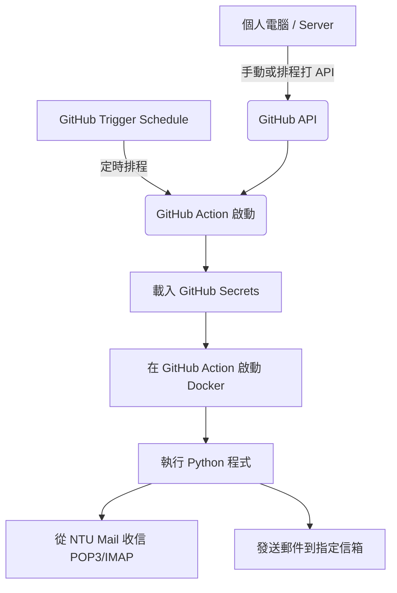

# 如何自動轉寄 NTU Mail？使用 GitHub Actions + Python 打造無伺服器郵件轉寄方案

一般的電子郵件服務（如 Gmail、Outlook）多數都提供方便的「自動轉寄（Auto Forwarding）」功能，可以輕鬆把收到的郵件同步轉寄到其他信箱。然而，**國立臺灣大學的郵件系統（NTU Mail）並未提供自動轉寄信件的功能。**

雖然常見的替代方案是透過個人 Gmail 設定代收／代發 `@ntu.edu.tw` 信件，但我並不想要設定 Gmail 代收信件，也不想登入多個不同信箱去檢查郵件。我過去處理多個信箱的習慣一直都是透過「轉寄信件」將所有信件集中到一個地方統一管理。

為了解決這個問題，我寫了一個 Python 程式 **General Mail Forwarder**，用來自動轉發 NTU Mail 到其他地方。

---

## 運作流程與架構

本方案採用完全**無伺服器（Serverless）**的架構，不需要自備 24 小時開機的伺服器。整體運作流程如下：



1. **觸發機制**：在個人電腦或 Server 上手動或透過排程呼叫 **GitHub API**，或者利用 GitHub Action 本身的定時排程（Cron Job）。
2. **啟動工作流**：觸發後啟動 **GitHub Action**。
3. **載入安全憑證**：從專案的 Repository 設定中安全載入加密的 **GitHub Secrets**（包含 NTU Mail 帳密與轉寄目標）。
4. **容器化執行**：在 GitHub Action 運行環境中啟動 **Docker 容器**。
5. **執行轉寄程式**：容器內執行 Python 程式，登入 NTU Mail 收取新信件，並完美重建郵件格式（包含 HTML、內嵌圖片與附件），最後轉寄至目標信箱。

---

## 為什麼選擇這個方案？

- **零成本**：完全依賴 GitHub 提供的免費 Actions 額度。
- **無伺服器維護壓力**：不用擔心家裡電腦斷電、公司 Server 掛掉，全部託管在 GitHub 基礎設施。
- **高安全性**：NTU 郵件密碼等敏感資訊安全地儲存在 GitHub Secrets 中，不會寫死在程式碼中，且程式碼完全開源可稽核。
- **格式完美保留**：Python 程式會重建郵件的 `multipart/mixed` 與 `multipart/alternative` 結構，確保轉寄後的排版、圖片與附件完全不會跑版。

---

## 快速上手與設定步驟

### 1. 取得專案並匯入
將本專案 Fork 或 Push 到你個人的私有 GitHub 儲存庫（建議使用 Private Repo 以保護隱私）：
[https://github.com/hcyuser/general-mail-forwarder](https://github.com/hcyuser/general-mail-forwarder)

### 2. 設定 GitHub Secrets
進入你個人的 GitHub Repository，點選 **Settings** -> **Secrets and variables** -> **Actions**，新增以下兩個 Repository Secrets：

- **`MAIL_ACCOUNTS`**：填入來源信箱（如 NTU Mail）的設定（JSON 格式）。例如：
  ```json
  [
    {
      "user": "your_username@ntu.edu.tw",
      "password": "your_ntu_mail_password",
      "protocol": "imap",
      "mail_receive_server": "mail.ntu.edu.tw",
      "mail_receive_port": 993,
      "smtp_server": "smtps.ntu.edu.tw",
      "smtp_port": 465
    }
  ]
  ```
- **`FORWARD_TO`**：填入接收轉寄郵件的目標信箱列表（JSON 陣列或逗號分隔字串）。例如：
  ```json
  ["your_personal_email@gmail.com"]
  ```

### 3. 設定 GitHub Actions 排程
在 `.github/workflows/mail_forwarder.yml` 中，可以設定自動運行的排程。例如，每天定時執行：
```yaml
name: Run Mail Forwarder

on:
  schedule:
    # 每天 UTC 03:00 / 台灣時間 11:00 執行
    - cron: '0 3 * * *'
  workflow_dispatch: # 支援手動觸發（可透過 GitHub 網頁或 GitHub API 觸發）

jobs:
  forward:
    runs-on: ubuntu-latest
    steps:
      - name: Checkout code
        uses: actions/checkout@v4

      - name: Run Mail Forwarder via Docker
        env:
          MAIL_ACCOUNTS: ${{ secrets.MAIL_ACCOUNTS }}
          FORWARD_TO: ${{ secrets.FORWARD_TO }}
        run: |
          docker build -t mail-forwarder .
          docker run --rm -e MAIL_ACCOUNTS="$MAIL_ACCOUNTS" -e FORWARD_TO="$FORWARD_TO" mail-forwarder
```

### 4. 透過 API 觸發轉寄 (手動/自建排程)
如果你希望在個人電腦或自己穩定的 Server 上，更頻繁地或在特定時間點觸發轉寄，可以使用 `curl` 打 GitHub API 觸發此 Workflow：

```bash
curl -X POST \
  -H "Accept: application/vnd.github+json" \
  -H "Authorization: Bearer <YOUR_GITHUB_PERSONAL_ACCESS_TOKEN>" \
  https://api.github.com/repos/<YOUR_GITHUB_USERNAME>/general-mail-forwarder/actions/workflows/mail_forwarder.yml/dispatches \
  -d '{"ref":"main"}'
```

這樣一來，無論是想透過本機 Cron Job 呼叫 API，還是使用 GitHub Actions 內建排程，都能極具彈性地將 NTU 信件安全地送到你想要的地方！

---

## 結語

**General Mail Forwarder** 解決了 NTU Mail 沒有自動轉寄、代收又延遲嚴重的痛點。透過 GitHub Actions 與 Docker 容器化技術，不需要花費一分錢即可建立穩定又安全的郵件轉發機制。

如果有任何問題或想提交功能改進，歡迎至 GitHub 提交 Issue 或 PR！
👉 **GitHub 專案網址**：[https://github.com/hcyuser/general-mail-forwarder](https://github.com/hcyuser/general-mail-forwarder)
