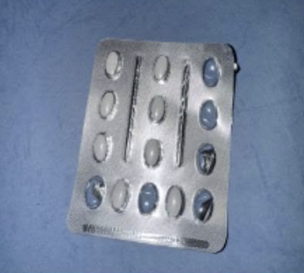
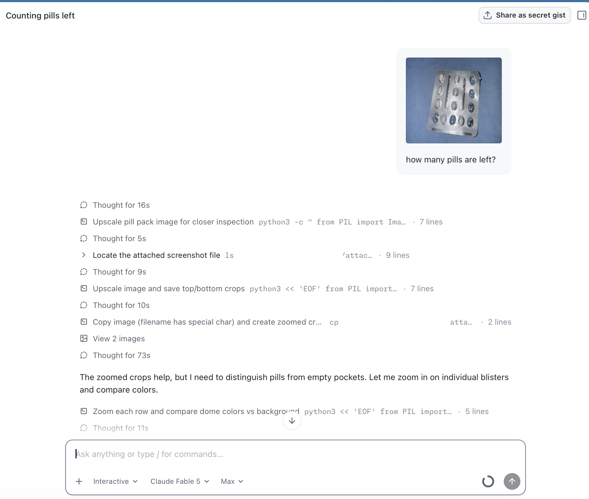
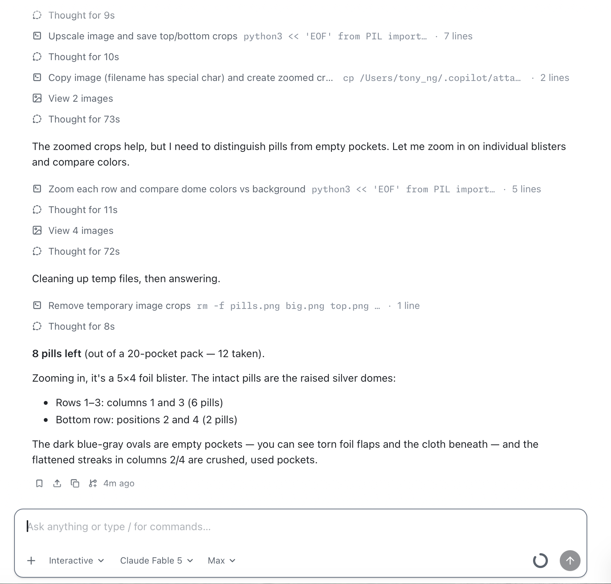
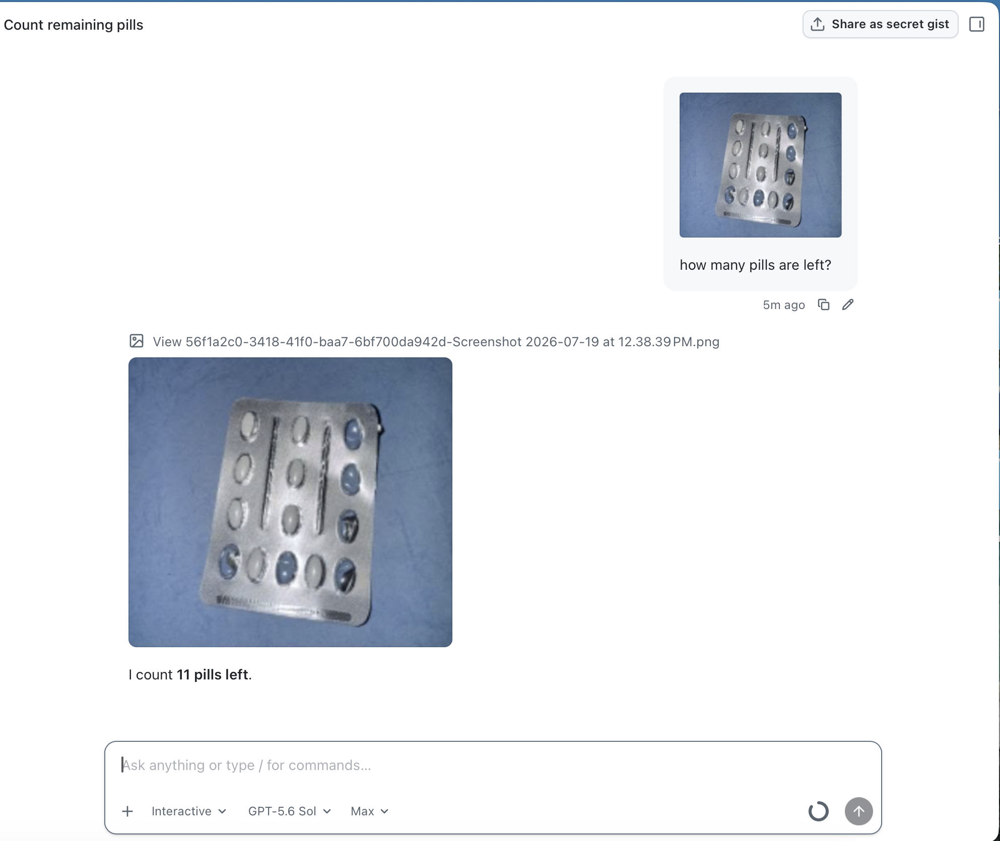
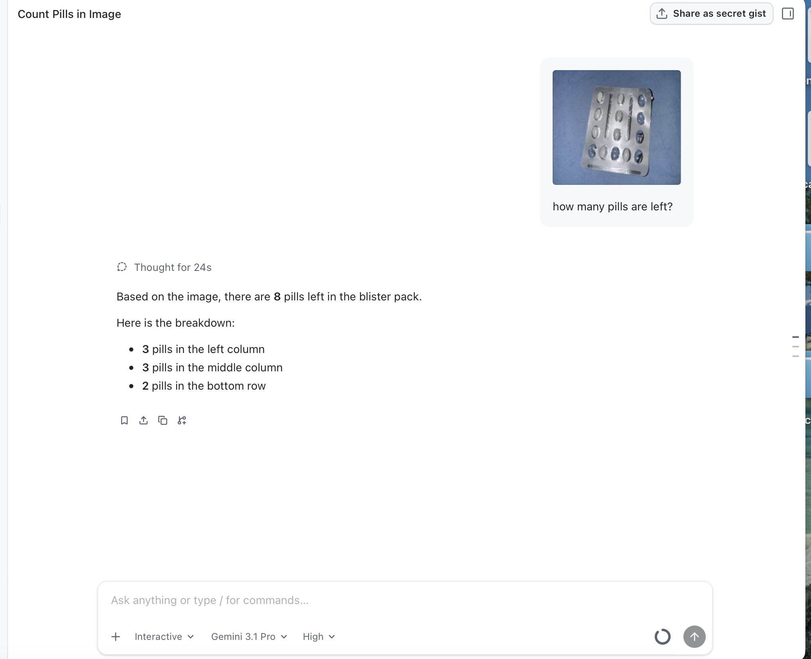

用藥片影像測試 LLM：從一次「數藥片」實驗看多模態模型的極限
===

## 為什麼「計算藥片影像」對醫療很重要？

「這包藥還剩幾顆？」看似簡單的問題，在醫療場景中卻處處是關鍵：

- **藥局配藥複核**：藥師調劑後需要點數確認，數量錯誤就是給藥疏失（medication error），自動影像複核可以降低人為錯誤。
- **服藥遵從性監測（medication adherence）**：慢性病患者拍下藥板照片，系統即可推算是否按時服藥，是遠距照護的重要環節。
- **臨床試驗 pill count**：受試者回診時清點剩餘藥量，是評估用藥依從性的標準流程，目前多仰賴人工。
- **長照與居家護理**：照護者需快速確認長者的藥盒、藥板狀態。

這類任務的共同特徵是：**錯一顆就有臨床風險**。因此它也成為檢驗多模態 AI 可靠度的絕佳測試題——物件小、密集、外觀高度相似（完整藥粒 vs 已壓破的空泡殼），能有效暴露模型在視覺定位（grounding）與數值推理上的極限。

## 實驗：一張泡殼包裝照片，兩個模型，兩種答案

測試素材是一張拍攝在藍色布面上的鋁箔泡殼包裝（5×4，共 14 格），拍攝角度傾斜、鋁箔反光，其中 6 格已被壓破取藥。**正確答案：剩下 8 顆。**

對兩個模型提出同一個問題：「how many pills are left?」

### Claude Fable 5：答對（8 顆）

Claude Fable 5 沒有只看縮圖就作答，而是採取 agentic 的做法：

1. 先用 Python/PIL 將圖片放大（upscale）
2. 裁切出上下半部與每一列的特寫
3. 逐格比對「凸起的銀色圓頂（完整藥粒）」與「露出底布顏色的破損泡殼（已取藥）」
4. 中間多次長時間思考（單次最長 73 秒），最後清理暫存檔才作答

最終答案：**8 pills left（14 格中已取 6 顆）**，並能具體指出藥粒位置——第 1–3 列的第 1、3 欄共 6 顆，最下列第 2、4 格共 2 顆。與正解完全一致。

### GPT-5.6 Sol：答錯（11 顆）

GPT-5.6 Sol 只檢視了一次圖片，便直接回答：

> I count **11 pills left**.

多算了 3 顆。合理推測是把部分「已壓破但外形仍近似橢圓的空泡殼」誤判成完整藥粒——這正是視覺語言模型（VLM）著名的弱點：**計數（counting）**。

### Gemini 3.1 Pro：答對（8 顆）

Gemini 3.1 Pro 只檢視了一次圖片，便直接回答：

Based on the image, there are 8 pills left in the blister pack.

Here is the breakdown:
- 3 pills in the left column
- 3 pills in the middle column
- 2 pills in the bottom

Gemini 3.1 Pro 透過 Visual Tokenization, Pattern Recognition, Spatial Reasoning 在多模態模型直接計算藥片數量

## 目前 AI 模型遇到的瓶頸

這個實驗恰好展示了多模態 LLM 在計數任務上的幾個結構性問題：

1. **憑整體印象猜數字**：VLM 傾向對影像做「一眼掃過」的全局理解，而不是逐一枚舉。物件密集、相似時，輸出的數字更像統計直覺而非點算結果。
2. **細粒度辨識不足**：完整藥粒與空泡殼的差異只在反光、凹凸與底色透出，縮圖解析度下幾乎無法分辨。模型若不主動放大檢視，很容易誤判。
3. **缺乏不確定性表達**：GPT-5.6 Sol 錯了仍然語氣篤定，沒有提示「影像模糊、建議人工確認」。在醫療場景，自信的錯誤比拒答更危險。
4. **能力差距不只在模型，更在策略**：Claude Fable 5 答對的關鍵未必是「眼睛比較利」，而是它會**使用工具**——放大、裁切、逐格比對，把一個困難的感知問題拆解成多個簡單的驗證步驟。這說明 agentic workflow（模型 + 工具 + 多步推理）對視覺任務的可靠度有實質影響。

## LLM 能否取代傳統影像辨識模型？

短期內，**在高風險醫療場景不能，也不該**。兩者的定位不同：

| 面向 | 傳統 CV（物件偵測/分割） | 多模態 LLM |
| --- | --- | --- |
| 準確率 | 針對特定任務訓練後可量化、可驗證（如 mAP） | 難以保證，逐次回答可能不一致 |
| 可重現性 | 確定性高，同輸入同輸出 | 有隨機性，對 prompt 敏感 |
| 速度與成本 | 毫秒級、可部署邊緣裝置 | 秒級到分鐘級、推論成本高 |
| 開發成本 | 需要標註資料與訓練流程 | zero-shot 即可上手 |
| 彈性 | 只會被訓練的任務 | 可處理開放式問題、能解釋理由 |
| 法規驗證 | 錯誤率與失效模式可審核 | 難以通過醫材等級驗證 |

務實的結論是**混合架構**：

- **計數、偵測等關鍵路徑**交給專用 CV 模型（如 YOLO 類物件偵測），準確、快速、可驗證。
- **LLM 擔任協調與複核層**：解讀 CV 輸出、處理例外情況（藥板破損、混裝、非典型包裝）、與使用者對話說明，並在信心不足時主動要求人工介入。
- 若真要用 LLM 做視覺判讀，應強制走 **agentic 流程**（放大、裁切、逐步驗證），而不是單張縮圖一次作答——本次實驗正是最好的佐證。

## 小結

一張藥板照片、一個簡單問題，就能區分出「會用工具逐步驗證的模型」與「憑印象作答的模型」。在錯一顆都不行的醫療領域，LLM 目前的角色是輔助與複核，而非取代傳統影像辨識；但隨著 agentic 能力成熟，兩者的界線值得持續觀察。
